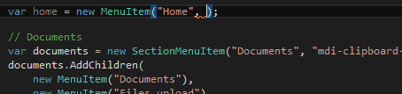

# MaterialDesignIcons-C#-Consts
This C# class allows you to use [MaterialDesignIcons](https://github.com/Templarian/MaterialDesign)
project directly from your C# code: benefit from autocomplete and avoid typos.



## How to use this
Add the nuget package as a depency in your project:

    PM> Install-Package MaterialDesignIcons-CSharp-Consts

Each `Mdi.*` const contains its icon's corresponding `mdi` class as value:

```csharp
public const string FlipToFront = "mdi-flip-to-front";
public const string Floppy = "mdi-floppy";
public const string Flower = "mdi-flower";
public const string Folder = "mdi-folder";
public const string FolderAccount = "mdi-folder-account";
public const string FolderDownload = "mdi-folder-download";
```

### Example
For example, you could use it in your own menu system:

```csharp
// MenuItem.cs
public MenuItem(string title, string href, string icon) { ... }

// NavigationHelper.cs
this.items.add(new MenuItem("Home", "#", Mdi.HomeVariant));
```

```html
<!-- _Menu.cshtml -->
<a href="@menuItem.Href">
    <i class="mdi @menuItem.Icon"></i>
    @menuItem.Title
</a>
```

## How to update `MaterialDesignIcons.cs.pp` file

> Note: you usually don't want to do that, except if some icons are missing from the generated file.

The `generate.py` script generates `MaterialDesignIcons.cs.pp` from MaterialDesignIcons input file.

1. Run `python generate.py`: [_variables.scss](https://raw.githubusercontent.com/Templarian/MaterialDesign-Webfont/master/scss/_variables.scss)
will be downloaded and parsed from MaterialDesignIcon's repository to update `MaterialDesignIcons.cs.pp`.
2. Open an issue here so I can update the nuget package
3. You could also copy `MaterialDesignIcons.cs.pp` into your project (don't forget to drop the `.pp` extension & update the namespace)
